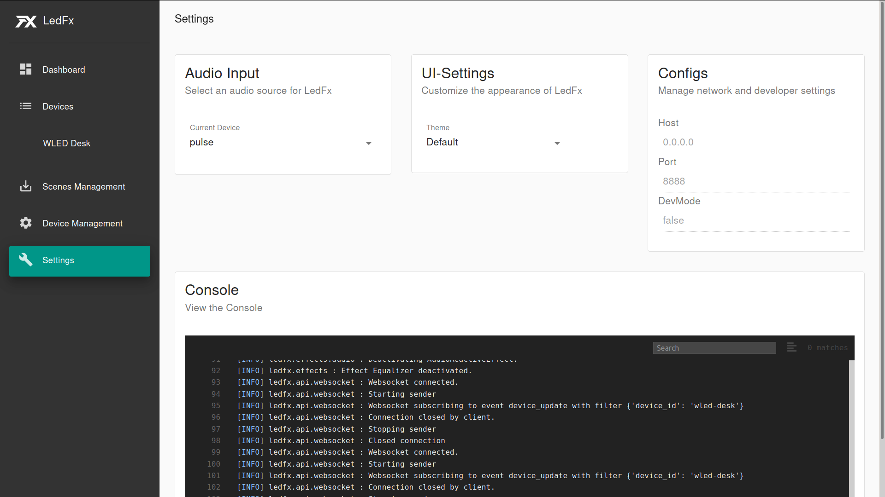

# Directing Audio

Here we explain how to pipe your system audio directly to LedFx without having to use a microphone or any other peripheral devices.

## Linux

Tested on Ubuntu 20.10 64-bit.

### Requirements

- [PulseAudio](https://www.freedesktop.org/wiki/Software/PulseAudio/?)
- [PulseAudio Volume Control](https://freedesktop.org/software/pulseaudio/pavucontrol/)

### Instructions

- In the LedFx UI under "Settings" -> "Audio Input", choose "pulse" as the current device

- In PulseAudio Volume Control under "Recording", choose "ALSA plug-in" and set "Capture from" to the audio stream you want to capture (e.g. "Monitor of Built-in Audio Analog Stereo")

